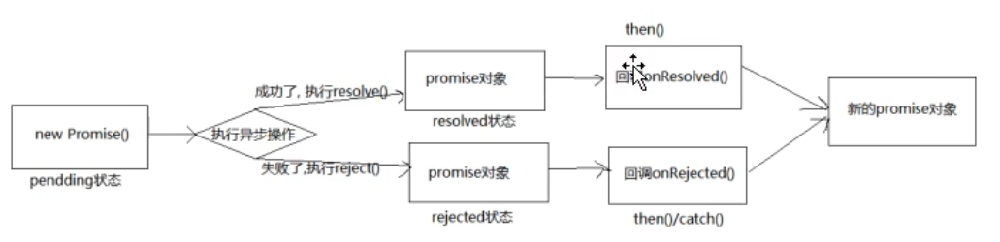

> * ES6 引入的进行异步编程的新的解决方案
> * 从语法来说, 就是构造函数, 可以封装异步的任务, 并对结果进行处理
## 1. Promise 介绍与基本使用
### Promise 是什么
  * 抽象表达
    1. Promise 是一门新的技术 (ES6 规范)
    2. Promise 是 JS 中进行异步编程的新解决方案
       备注: 旧方案就是单纯使用回调函数
       * 异步编程
         * fs 文件操作
           ```javascript
           require('fs').readFile('./index.html', (err, data) => {});
           ```
         * 数据库操作
         * AJAX
           ```javascript
           $.get('/server', (data) => {});
           ```
         * 定时器
           ```javascript
           setTimeOut(() => {}, 2000);
           ```
  * 具体表达
    1. 从语法上来说: Promise 是一个构造函数
    2. 从功能上来说: Promise 对象用来封装一个异步操作并可以获取成功/失败的结果值
### 为什么要用 Promise?
  * 指定回调函数的方式更加灵活
    * 旧的: 必须在启动异步任务前指定
    * promise: 启动异步任务 -> 返回promise对象 -> 给promise对象绑定回调函数(甚至可以在异步任务结束后指定/ 多个)
  * 支持**链式调用**,可以解决回调地狱问题
    * 什么是回调地狱?
      * 回调函数嵌套调用, 外部回调函数异步执行结果是嵌套的回调执行条件
      ```javascript
        asyncFunc1(opt, (...args1) => {
            asyncFunc2(opt, (...args2) => {
                asyncFunc3(opt, (...args3) => {
                    asyncFunc4(opt, (...args4) => {
                        // some operations
                    });
                });
            });
      });
      ```
    * 回调地狱的缺点?
      * 不便于阅读
      * 不便于异常处理
    * 解决方案?
### Promise 的状态改变
1. pending 变为 resolved
2. pending 变为 rejected
说明: 只有这2种. 且一个 promise 对象只能改变一次
        无论变为成功还是失败, 都会有一个结果数据
        成功的结果数据一般称为 value , 失败的结果数据一般称为 reason
* PromiseResult
   * 实例对象的属性
   * 保存着 成功/失败的 值
### Promise 的基本流程

## 2. Promise API
### 如何使用 Promise?
* API
  1. Promise 的构造函数: `Promise(executor){}`
     * executor 函数: 执行器 `(resolve, reject) => {}`
     * resolve 函数: 内部定义成功时我们调用的函数 `value => {}`
     * reject 函数: 内部定义失败时我们调用的函数 `reason => {}`
     * 说明: executor 会在 Promise 内部立即同步调用, 异步操作会在执行器中执行
  2. Promise.prototype.then 方法: `(onResolved, onRejected) => {}`
     * onResolved 函数: 成功的回调函数 `(value) => {}`
     * onRejected 函数: 失败的回调函数 `(reason) => {}`
     * 说明: 指定用于得到成功 value 的成功回调和用于得到失败 reason 的失败回调, 返回一个新 Promise 对象
  3. Promise.prototype.catch 方法: `(onRejected) => {}`
     * onRejected 函数: 失败的回调函数 `(reason) => {}`
  4. Promise.resolve 方法: `(value) => {}`
     * value: 成功的数据 或 promise 对象
     * 说明: 返回一个成功/失败的 promise 对象
  5. Promise.reject 方法: `(reason) => {}`
     * reason: 失败的原因
     * 说明: 返回一个失败端 promise 对象
  6. Promise.all 方法: `(promises) => {}`
     * promises: 包含 n 个 promise 的数组
     * 说明: 返回一个新的 promise , 只有所有的 promise 都成功才成功, 否则直接失败
  7. Promise.race 方法: `(promises) => {}`
      * promises: 包含 n 个 promise 的数组
      * 说明: 返回一个新的 promise , 第一个完成的 promise 的结果状态就是最终的结果状态
## 3. Promise 关键问题
1. 如何改变 Promise 的状态?
   1. resolve(value): 如果当前是 pending 就会变为 resolved
   2. reject(reason): 如果当前是 pending 就会变为 rejected
   3. 抛出异常: 如果当前是 pending 就会变为 rejected
2. 一个 Promise 指定多个成功/失败回调函数, 都会调用吗?
   * 当 promise 改变为对应状态时, 都会调用
3. 改变 Promise 状态和指定回调函数 谁先谁后?
   1. 都有可能, 正常情况下是先指定回调再改变状态. 但也可以先改变状态再指定回调函数
   2. 如何先改状态再指定回调?
      * 在执行器中直接调用 `resolve()/reject()`
      * 延迟更长时间才调用 `then()`
   3. 什么时候才能得到数据?
      * 如果先指定的回调, 那当状态发生改变时, 回调函数就会调用, 得到数据
      * 如果先改变的状态, 那当指定回调时, 回调函数就会调用, 得到数据
4. Promise.then() 返回的新 promise 的结果状态由谁决定?
   * 简单表达: 由 then() 指定的回调函数执行结果决定
   * 详细表达:
     * 如果抛出异常, 新的 promise 变为 rejected, reason 为抛出的异常
     * 如果返回的是非 promise 的任意值, 新 promise 变为 resolved, value 为返回的值
     * 如果返回的是另一个新的 promise, 此 promise 的结果 就会成为新 promise 的结果
5. Promise 如何串连多个操作任务?
   * promise 的 then() 返回的是一个新的 promise, 可以看成 then() 的链式调用
   * 通过 then() 的链式调用串连多个同步/异步任务
6. Promise 异常穿透?
   * 当使用 promise 的 then 链式调用时, 可以在最后指定失败的回调
   * 前面任何操作出了异常, 都会传到最后失败的回调中处理
7. 中断 Promise 链?
   * 当使用 promise 的 then 链式调用时, 在中间中断, 不再调用后面的回调函数
   * 办法: 在回调函数中 返回一个 pending 状态的 promise 对象
## 4. Promise 自定义封装
> 自定义(手写)Promise
### 定义整体结果
```javascript
// 自定义 Promise

function (window) {
    /*
     * Promise 构造函数
     * executor: 内部同步执行的函数 (resolve, reject) => {}
     */
    function Promise(executor) {
        
    }
}
```
## 5. async 与 await
### mdn 文档
* [async](https://developer.mozilla.org/zh-CN/docs/Web/JavaScript/Reference/Statements/async_function)
* [await](https://developer.mozilla.org/zh-CN/docs/Web/JavaScript/Reference/Operators/await)
### async 函数
1. 函数的返回值为 promise 对象
2. promise 对象的结果由 async 函数执行的返回值决定
### await 表达式
1. await 右侧的表达式一般为 promise 对象, 但也可以是其他的值
2. 如果表达式是 promise 对象, await 返回的是 promise 成功的值
3. 如果表达式是其他值, 直接将此值作为 await 的返回值
> * await 必须写在 async 函数中, 但 async 函数中可以没有 await
> * 如果 await 的 promise 失败了, 就会抛出异常, 需要通过 try... catch 捕获处理